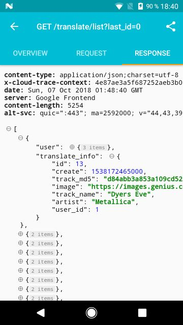

# Chuck(json highlight)
#### Fork with json highlight and hidden chuck library resources.
[](https://jitpack.io/#RomanTsarou/chuck)


Chuck is a simple in-app HTTP inspector for Android OkHttp clients. Chuck intercepts and persists all HTTP requests and responses inside your application, and provides a UI for inspecting their content.


Apps using Chuck will display a notification showing a summary of ongoing HTTP activity. Tapping on the notification launches the full Chuck UI. Apps can optionally suppress the notification, and launch the Chuck UI directly from within their own interface. HTTP interactions and their contents can be exported via a share intent.

The main Chuck activity is launched in its own task, allowing it to be displayed alongside the host app UI using Android 7.x multi-window support.


Chuck requires Android 4.1+ and OkHttp 3.x.

**Warning**: The data generated and stored when using this interceptor may contain sensitive information such as Authorization or Cookie headers, and the contents of request and response bodies. It is intended for use during development, and not in release builds or other production deployments.

Setup
-----

Add the dependency in your `build.gradle` file:

```gradle
repositories {
    maven { url "https://jitpack.io" }
}

 dependencies {
   debugImplementation 'com.github.RomanTsarou:chuck:1.1.2'
 }
```

In your application code, create an instance of `ChuckInterceptor` (you'll need to provide it with a `Context`, because Android) and add it as an interceptor when building your OkHttp client:

```java
OkHttpClient client = new OkHttpClient.Builder();
 if (BuildConfig.DEBUG) {
            try {
                Interceptor interceptor =
                        (Interceptor) Class.forName("com.readystatesoftware.chuck.ChuckInterceptor")
                                .getConstructor(Context.class)
                                .newInstance(context);
                client.addInterceptor(interceptor);
            } catch (Exception e) {
                // ignore
            }
        }
```

That's it! Chuck will now record all HTTP interactions made by your OkHttp client. You can optionally disable the notification by calling `showNotification(false)` on the interceptor instance, and launch the Chuck UI directly within your app with the intent from `Chuck.getLaunchIntent()`.

FAQ
---

- Why are some of my request headers missing?
- Why are retries and redirects not being captured discretely?
- Why are my encoded request/response bodies not appearing as plain text?

Please refer to [this section of the OkHttp wiki](https://github.com/square/okhttp/wiki/Interceptors#choosing-between-application-and-network-interceptors). You can choose to use Chuck as either an application or network interceptor, depending on your requirements.

Acknowledgements
----------------

Chuck uses the following open source libraries:

- [OkHttp](https://github.com/square/okhttp) - Copyright Square, Inc.
- [Gson](https://github.com/google/gson) - Copyright Google Inc.
- [Cupboard](https://bitbucket.org/littlerobots/cupboard) - Copyright Little Robots.

This fork also use:

- [renderscript](https://github.com/caldwell/renderjson) - Copyright David Caldwell


License
-------

    Copyright (C) 2017 Jeff Gilfelt.

    Licensed under the Apache License, Version 2.0 (the "License");
    you may not use this file except in compliance with the License.
    You may obtain a copy of the License at

       http://www.apache.org/licenses/LICENSE-2.0

    Unless required by applicable law or agreed to in writing, software
    distributed under the License is distributed on an "AS IS" BASIS,
    WITHOUT WARRANTIES OR CONDITIONS OF ANY KIND, either express or implied.
    See the License for the specific language governing permissions and
    limitations under the License.
